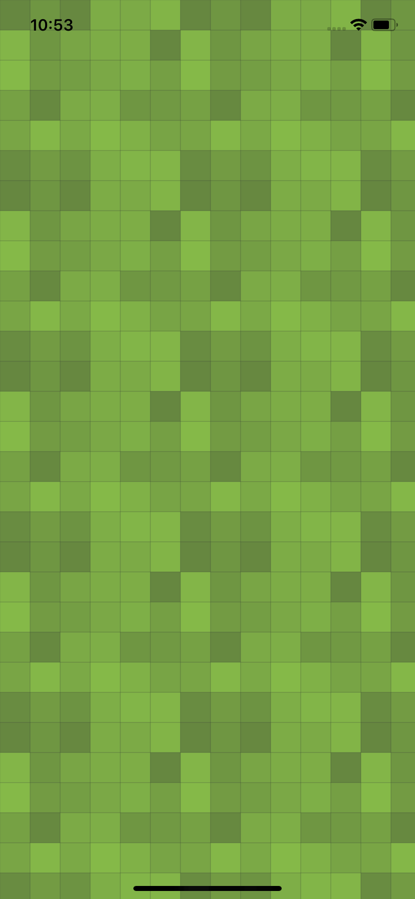

# geopattern

Geometric Patterns for Flutter using `CustomPainter`s.

## Fully Custom Pattern

```dart
void main() => runApp(MyApp());

class MyApp extends StatelessWidget {
  @override
  Widget build(BuildContext context) {
    return LayoutBuilder(builder: (context, constraints) {
      final gen = Random();
      final pattern = Squares(
          size: 30,
          nx: 6,
          ny: 6,
          fillColors: List.generate(
              36,
              (int i) => Color.fromARGB(
                  10 + (gen.nextDouble() * 100).round(),
                  50 + gen.nextInt(1) * 150,
                  50 + gen.nextInt(1) * 150,
                  50 + gen.nextInt(1) * 150)),
          strokeColor: Color.fromARGB(50, 50, 50, 50));
      return CustomPaint(
          size: Size(constraints.maxWidth, constraints.maxHeight),
          painter:
              FullPainter(pattern: pattern, background: Colors.lightGreen));
    });
  }
}
```

creates


