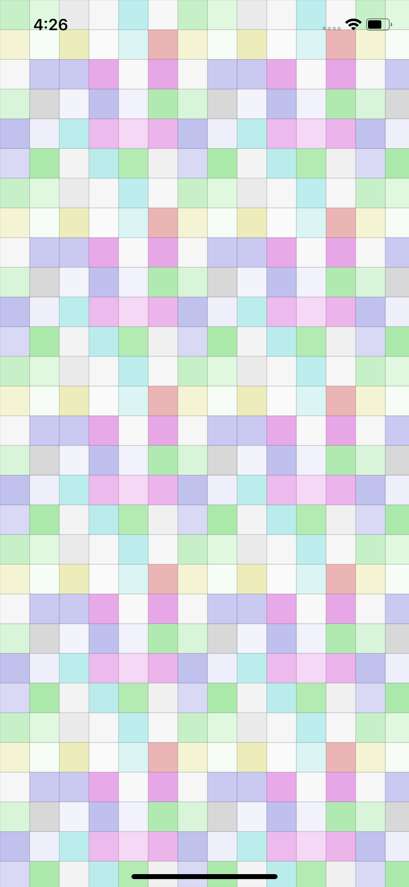
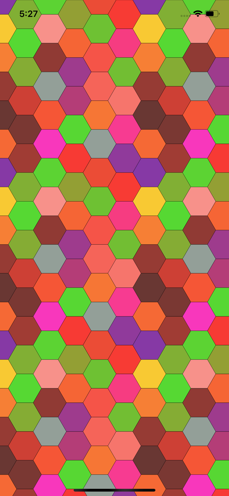
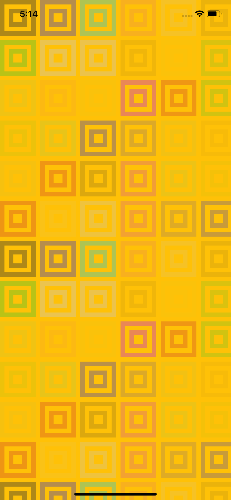
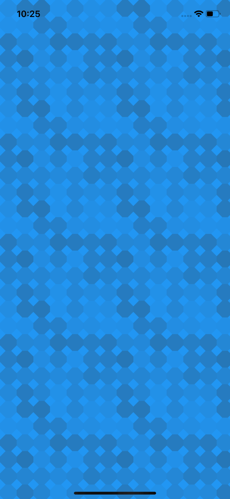

# geopattern

> Flutter Port of [jasonlong/geo_pattern](https://github.com/jasonlong/geo_pattern)

Geometric Patterns for Flutter using `CustomPainter`s.

<div>











</div>

## Simple Example

```dart
import 'dart:convert';

import 'package:crypto/crypto.dart';
import 'package:flutter/material.dart';
import 'package:geopattern/geopattern.dart';
import 'package:geopattern/patterns/mosaic_squares.dart';

void main() => runApp(App());

class App extends StatelessWidget {
  @override
  Widget build(BuildContext context) {
    final hash = sha1.convert(utf8.encode("flutter")).toString();
    return LayoutBuilder(builder: (context, constraints) {
      final pattern = MosaicSquares.fromHash(hash);
      return CustomPaint(
          size: Size(constraints.maxWidth, constraints.maxHeight),
          painter: FullPainter(pattern: pattern, background: Colors.blueGrey));
    });
  }
}
```

creates


Patterns are fully customizable, for example a pattern created as

```dart
final pattern = ConcentricCircles(
  radius: 40,
  strokeWidth: 8,
  nx: 6,
  ny: 6,
  strokeColors: List.generate(
      36,
      (int i) => Color.fromARGB(
          10 + (gen.nextDouble() * 100).round(),
          50 + gen.nextInt(2) * 150,
          50 + gen.nextInt(2) * 150,
          50 + gen.nextInt(2) * 150)),
  fillColors: List.generate(
      36,
      (int i) => Color.fromARGB(
          10 + (gen.nextDouble() * 100).round(),
          50 + gen.nextInt(2) * 150,
          50 + gen.nextInt(2) * 150,
          50 + gen.nextInt(2) * 150)));
```

renders


Each pattern has an associated `size`. The `FillPainter` class implements `CustomPainter` such that the pattern is repetitively painted across the entire width and height of the canvas. However, each `Pattern` has a `paint(Canvas, Offset)` method that can be used to paint on its own.

There is an example for using a pattern as a background for `SliverAppBar` in `examples/appbar.dart`

[Demo](https://i.imgur.com/iPj0sMo.mp4)

### TODO

- Tesselation
- Xes
